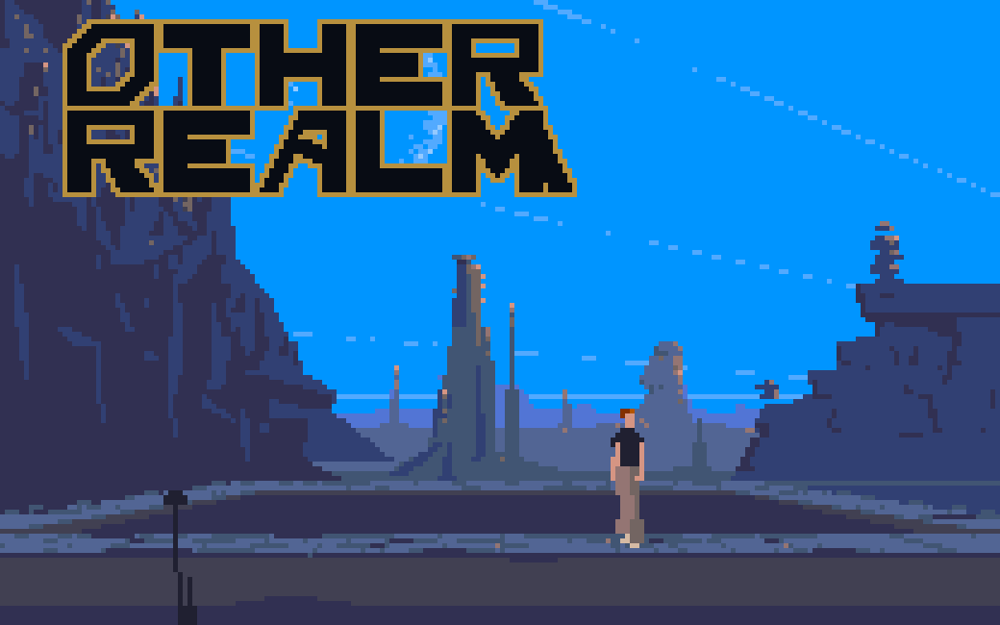
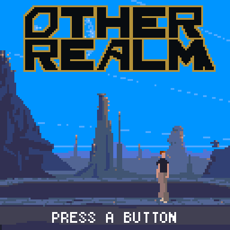
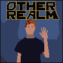

<a id="readme-top"></a>

<div align="center">



<h3>A whole other world. A very small handheld.</h3>

<p>
  Cinematic vector animation, streamed from microSD.<br>
  A 48 MHz RISC-V, 20 KB of RAM, and a 128 × 128 window into Another World.
</p>

[](https://github.com/bateske/Otherrealm/releases)
[](https://github.com/bateske/CHGame)
[](LICENSE)
[](#how-it-works)
[](#how-it-works)

<p>
  <a href="https://github.com/bateske/Otherrealm/releases"><strong>Download the engine & patcher »</strong></a><br><br>
  <a href="#getting-started">Get playing</a> ·
  <a href="#controls">Controls</a> ·
  <a href="BUILDING.md">Build it</a> ·
  <a href="#credits">Credits</a> ·
  <a href="https://github.com/bateske/Otherrealm/issues">Report a bug</a>
</p>

</div>

<details>
<summary><strong>Explore the project</strong></summary>

- [About the game](#about-the-game)
- [Controls](#controls)
- [Getting started](#getting-started)
- [How it works](#how-it-works)
- [Compatibility](#compatibility)
- [Credits](#credits)
- [License](#license)

</details>

## About the game

A late-night experiment. A flash of light. Cold water beneath an alien sky.

**Other Realm** brings the polygon animation and scripted adventure of Éric
Chahi's *Another World* to the [CHGame handheld](https://github.com/bateske/CHGame).
The engine draws the original vector scenes as they play, reading scripts,
shapes, and palettes from the SD card. A small, purpose-built interface adds
autosaves, readable menus, and a little magic.

<p align="center">
  <br>
  <sub>Recorded from the real C++ engine in the simulator. Selected shots retain their engine timing; enlarged 3× for this page.</sub>
</p>

- **Vector scenes on demand.** Polygon hierarchies and cooperative bytecode tasks stream from SD through a small sector cache.
- **Pick up where you left off.** Nineteen original checkpoint destinations save automatically. No passwords to remember.
- **Made for 128 × 128.** Patched text screens, native bitmap menu fonts, full-screen title art, and a gently pulsing start prompt.
- **A quiet bit of atmosphere.** Menus fade over the darkened scene, with wandering sparkles, selection dust, and a soft confirmation burst.
- **A reward for finishing.** Complete the game to unlock the raised-hand greeting as your title background.
- **Your files, your cartridge.** The patcher validates your original resources, adapts them, renders the title scenes, and packages a personal `.chgame`.
- **An original game included.** [Signal Grove](demo/README.md) is a small, freely distributable vector adventure for trying the engine or learning to author scenes.

## Controls

| Button | In the game | In menus |
|---|---|---|
| D-pad | Move; Up jumps or swims upward | Up / Down selects |
| A | Action, run, shoot | Confirm |
| B | Jump shortcut | Back; return from the main menu to the title |
| Start | Tap to pause; **hold 3 seconds** to return to the CHGame launcher | Resume / back; hold to exit |
| Select | Open the pause menu | Back |

**At the very beginning, hold Up + A to swim out of the pool.** Once Lester
has climbed onto the bank, move away from the water. Hold A with a direction to
run. Later, the action button also controls the gun; how long you hold it matters.

Every boot begins at the title. A new game starts with the intro; press Start
during it for **Skip Intro**. **Resume** keeps your exact current position in
memory. **Retry Save** and **Continue** restart at the latest earned checkpoint.
Starting a new game asks before replacing an existing checkpoint. Sound can be
toggled in the menu.

## Getting started

### 1. Own the original game

Support the original creators: [Another World — 20th Anniversary Edition on Steam](https://store.steampowered.com/app/233550/Another_World__20th_Anniversary_Edition/).

> **Current release: Amiga profile, Steam import pending.** The validated patcher
> accepts the English Amiga ADF pair used during development. The Steam edition
> uses different resources and has not yet been validated. Buying Steam alone
> does **not** currently provide the ADF input this release needs. You can try
> the included original **Signal Grove** game without supplying any commercial data.

To locate a Steam installation, use **Library → Another World → Manage → Browse
local files**. The anniversary edition keeps its resources under `game/DAT`,
`game/BGZ`, and `game/TXT`. Keep that folder intact for future Steam support;
renaming those files will not turn them into the supported Amiga edition.

For the current profile, place both of your original Amiga `.adf` disks in one
folder. The patcher checks the executable and scripts before applying adaptations;
an unsupported revision stops with an error instead of producing a broken game.

### 2. Build your personal cartridge

Download **Otherrealm-Patcher-Windows.zip** from [Releases](https://github.com/bateske/Otherrealm/releases).
Extract the entire folder, open **Otherrealm-Patcher.exe**, choose your source
folder and a new output folder, then click **Build my cartridge**.

No Python, Node, compiler, or online account is needed to run the Windows patcher.
It leaves your source files unchanged and writes:

| Output | What it is for |
|---|---|
| `Otherrealm.chgame` | Personal cartridge with firmware, cover, metadata, and your adapted game data |
| `sdcard/` | Two ready-to-copy files for the SD card |
| `Otherrealm.bin` | Firmware for direct USB upload |
| `cover.png` | Native 128 × 128 cartridge art |
| `patch-report.json`, `verification.json` | Applied changes, input hashes, and package validation |
| `START-HERE.txt` | A short installation and controls guide |

**Keep the generated cartridge and game pack private.** They contain your original
game data. The public downloads contain the engine, patcher, and original demo.

### 3. Install on CHGame

With the [CHGame desktop tools](https://github.com/bateske/CHGame) installed and
your FAT16/FAT32 card mounted, import the cartridge into the card's game collection:

```powershell
chgame cart deploy .\Otherrealm-personal\Otherrealm.chgame --card E:\ --port COM8 --no-flash
```

Use your own drive letter and port. Safely eject the card, put it in CHGame, and
select **OTHER REALM**. The bootloader installs the game from the card.

**Using the Arduino board-package uploader:** first copy the contents of the
generated `sdcard/` folder to the card root and safely eject it. From the extracted
Windows patcher folder, run:

```powershell
.\Upload-Cartridge.ps1 -Cartridge C:\Games\Otherrealm-personal\Otherrealm.chgame -Port COM8
```

The helper validates and extracts the `.chgame`, then calls the installed
`chgame-upload` tool from the CHGame board package. That uploader accepts firmware
images rather than `.chgame` archives directly. The SD data is needed with either
installation method.

See the [complete installation guide](docs/INSTALL.md) for tool setup and
troubleshooting. Prefer compiling the engine and copying files yourself? Follow
the **[developer method](BUILDING.md)** with Arduino CLI.

## How it works

The small amount of RAM limits what is visible at once, not how much adventure
can live on the card. The engine keeps four drawing pages in memory and fetches
the scripts and shapes needed for the current scene. A scene can replace its
resources without recompiling the firmware.

| Resource | Current CHGame Rev0 build |
|---|---|
| CPU | CH32X035, 48 MHz RISC-V |
| Application image | **33,808 bytes** |
| Static RAM | **17,980 bytes** |
| Reserved stack / measured peak | 2,048 bytes / 1,040 bytes in the profiled run |
| Drawing pages | Four 104 × 65 pages, 16 colors; 13,520 bytes total |
| Display | 128 × 80 gameplay preserving 8:5; 128 × 128 titles and interface |
| SD cache | Three shared 512-byte sectors |
| Adapted development game pack | 1,456,640 bytes, including both title backgrounds |

The integer renderer, interpreter, and session code also compile to WebAssembly.
The browser preview runs the same C++ engine and reads a selected game pack
locally. Resource conversion and decompression happen on the computer, before
play. No second full-screen framebuffer is needed on the handheld.

This is a vector engine with bitmap compatibility for the original game's few
bitmap scenes. It has no desktop SDL dependency, sampled-audio mixer, or visual
scene editor. Each script/shape segment has a 64 KiB address space; larger
adventures use more scenes. Card capacity does not remove those per-scene limits.

Explore the [engine overview](docs/ENGINE.md), [pack format](tools/PACK_FORMAT.md),
[text patches](docs/TEXT_PATCHES.md), [checkpoints](docs/checkpoints.md),
[hardware measurements](docs/HARDWARE.md), and [title/menu design](docs/TITLE_AND_MENU.md).

## Compatibility

The complete intro and opening gameplay have run on the handheld. Automated
tests cover startup replays of all seven gameplay parts, nineteen checkpoint
destinations, save persistence, rendering, and the original demo. **This is not
a claim of a complete end-to-end playthrough.** See [test evidence](docs/PERFORMANCE.md).

Sound uses lightweight piezo cues; the original sampled soundtrack and effects
are not mixed. The flash journal retains one installed game's save, so another
game's first save can replace it. Browser saves are separate from device saves.
Fractional scaling of the gameplay canvas can make some in-game lettering uneven;
menu fonts are rendered at native screen resolution.

<p align="center">
  <br>
  <sub>Native 128 × 128 cover, composed from an original game scene and the Other Realm wordmark.</sub>
</p>

## Credits

**The world we are visiting**

- **Éric Chahi** — creator of *Another World*, its design, programming, and artwork.
- **Jean-François Freitas** — the original music and sound.
- **Delphine Software** — the original publisher.
- **Éric Chahi and DotEmu**, with **The Digital Lounge** — the Steam 20th Anniversary edition.

**The work that made this adaptation possible**

- **Gregory Montoir** — [RawGL](https://github.com/cyxx/rawgl) and the interpreter lineage that documents the game's behavior and formats.
- **Fabien Sanglard** — [Another World Bytecode Interpreter](https://github.com/fabiensanglard/Another-World-Bytecode-Interpreter), whose annotations informed this implementation. The compatibility font/string tables retain their upstream license.
- **G. Megidish** — [Another World Hebrew patcher](https://github.com/gmegidish/another-world-hebrew), inspiration for adapting resource scripts. No code or assets from that patcher are included.
- **Kevin Bates / bateske** — [CHGame](https://github.com/bateske/CHGame), the hardware, board package, SD support, bootloader, cartridge tools, and direction of this adaptation.
- **The X11 Misc Fixed font contributors** — public-domain 8×13 Bold and 5×8 bitmap fonts, sourced from PixelLogoLab.
- **[Ethan's Critters](https://github.com/bateske/EthansCritters)** — the README structure and presentation template.
- **OpenAI Codex** — implementation and testing assistance, directed and playtested by Kevin Bates.

More useful exploration: [noteed/exploring](https://github.com/noteed/exploring)
and [Another World source reconstruction](https://github.com/ArqueologiaDigital/another-world-source-reconstruction).
Exact source revisions, imported components, and notices are in [THIRD_PARTY.md](THIRD_PARTY.md).
Media capture provenance is in [docs/MEDIA.md](docs/MEDIA.md).

## License

| Component | License |
|---|---|
| Portable engine and applicable source tools | [GPL-2.0-or-later](LICENSE) |
| Combined device build and release packager | [GPL-3.0-or-later](firmware/Otherrealm/LICENSE_GPL3.txt) |
| Original Signal Grove content and Other Realm wordmark | [CC0-1.0](demo/LICENSE.txt) |
| Original Another World game content | Rights remain with its respective owners; not included as playable data |

This is an independent compatibility project, not an official port or an
endorsement by the original creators. Screenshots and gameplay footage depict
the original game; they are not reusable GPL/CC0 game assets. Do not redistribute
generated personal cartridges, extracted banks, disk images, or adapted game packs.

<p align="right"><a href="#readme-top">Back to top ↑</a></p>
